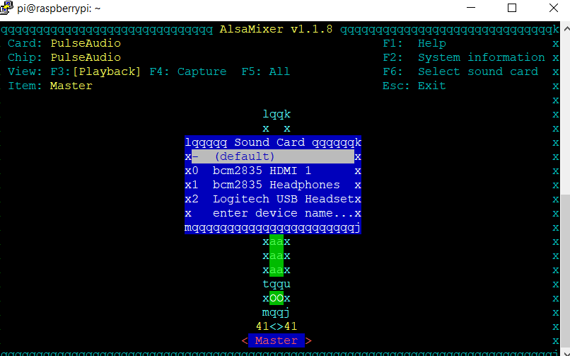
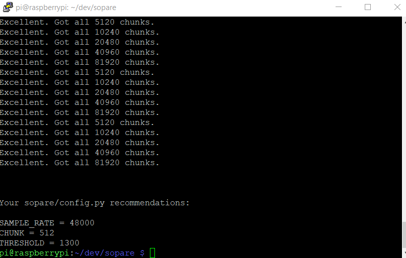
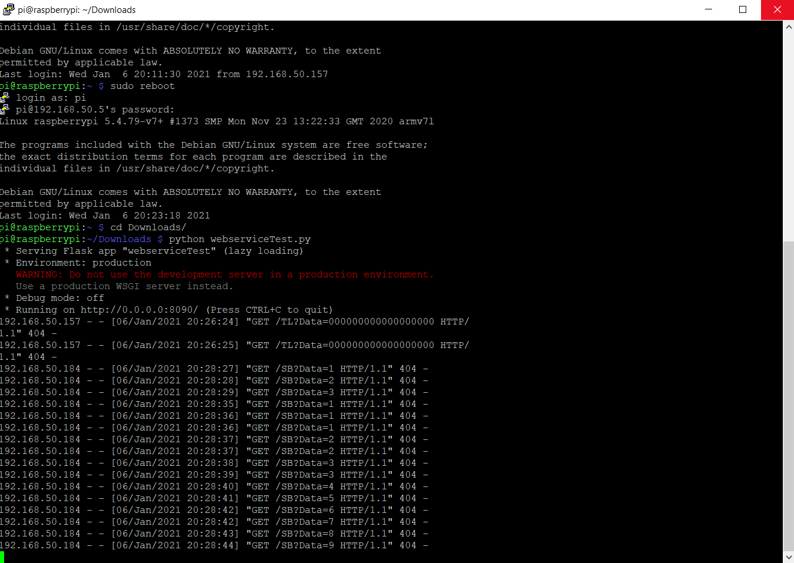
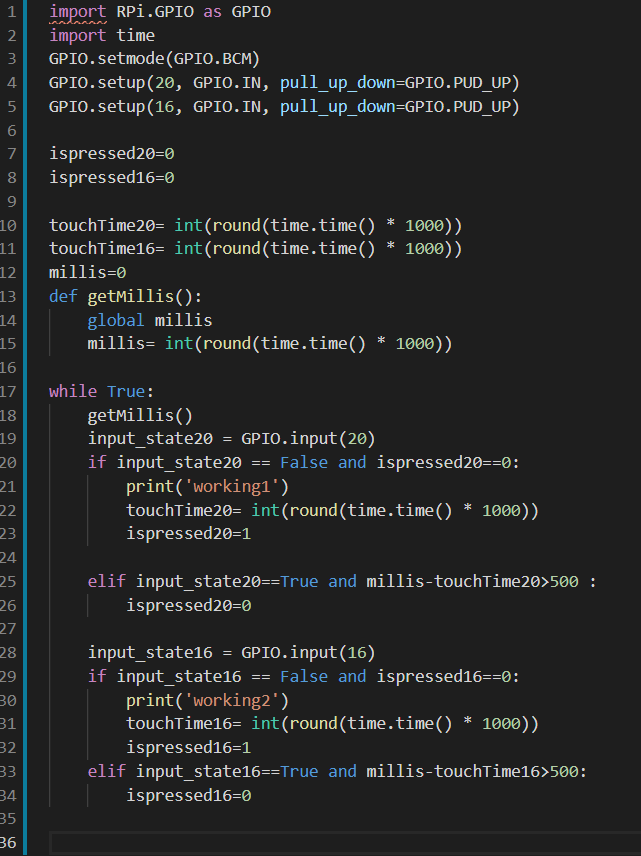
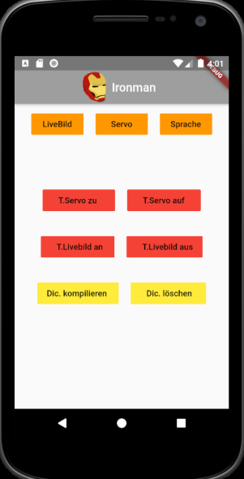
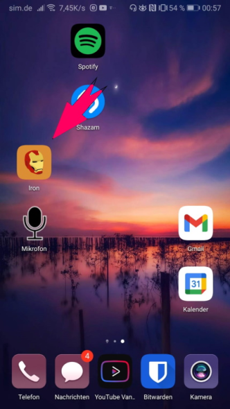
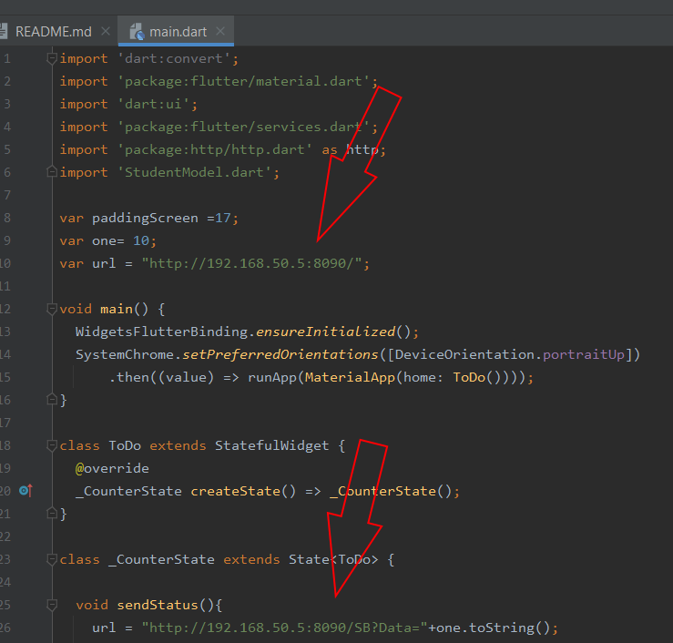
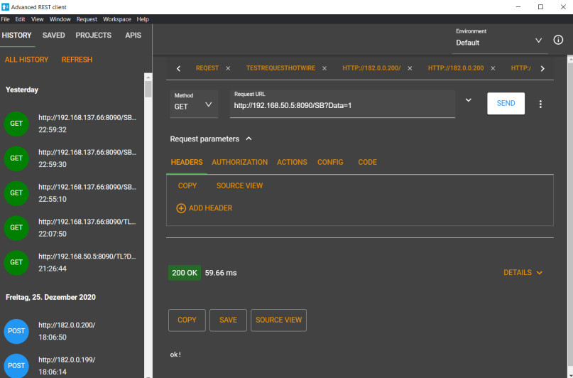
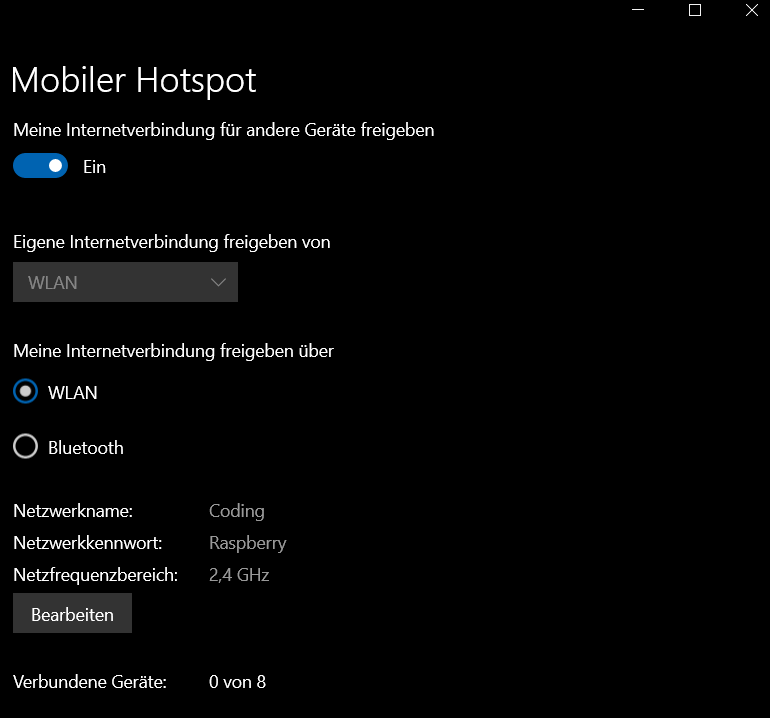

# Helmsteuerung Ironman 
Dieses Repository befasst sich mir der Entwicklung einer Software, für die Steuerung eines "Ironman Helmes".

Dieses Projekt enthält Drittanbieter Software.
Herzlichen Dank vorallem an den Entwickler von Sopare!

    - Benutzername: pi
    - Passwort: 123456789
Hotspot Wifi Settings:
   
    - SSID: Ironman Wifi
    - Wifi-Passwort: 827hd73n28
    
Coding Wifi Settings:

    - SSID: Coding
    - Passwort: Raspberry
    
    
#### Hier geht es zu einem Video, welches die Funtionsweise zeigt: [Video](https://drive.google.com/file/d/19hK0NiqJspJTZMuc9VAi2S3LpeVys6pV/view?usp=sharing)
### Update:
#### Aus Zeitgründen wurde eine LightVersion der App hochgeladen, über diese kann das Livebild, der Servo und der Zustand der Spracherkennung gesteuert werden.
#### Anlernen von Befehlen und das Handling vom Dictionary sind damit nicht möglich!
_*Inhaltsverzeichnis:*_
  - Funktionsumfang
  - Plattform
  - Sprachsteuerung
  - Pinbelegung GPIO
  - Manuelle Installationsanleitung
    - Installation von Raspbian
    - Optional: WPA Config und SSH aktivieren
    - Update/Upgrade vom System
    - Optional: Remote Desktop installieren
    - Tipp: Daten auf den Pi kopieren und herunterladen!
    - Installation der GPIO Python Bibliothek (RPi.GPIO 0.7.0)
    - Raspberry Pi Kamera im Setup aktivieren
    - Installation von Sopare Dependencies
    - Erstellung Hotspot (nur auf unterstützter Hardware!)
    - Weitere Pakete für Sprachsteuerung (Feedback Monitor)
  - Mikrofon auswählen und Sopare Einstellungen
    - Alsamixer Standardmikrofon einstellen
    - Sopare Unit Test
    - Sopare Mikrofoneinstellungen
  - Manuelles Anlernen von Befehlen (Sopare-Benutzung ohne App)
  - Testprogramme für die einzelnen Funktionen
    - Servotest
    - Livebild Test
    - Webserver für HTTP Request Kontrolle (APP)
    - GPIO Taster Test
    - Hinweis zur GPIO Ansteuerung
  - Flutter APP zur Steuerung
     - App Bedienungsanleitung
     - Besonderheit der App (Vereinfachung)
  - Verbesserungsvorschläge, Features die noch fehlen
  - Q&A
  - Entwicklermodus
  - **Versionen von diesem Projekt (nur GPIO Control, nur App Control usw.)**
  - **Autostart Option für das gewählte Skript**
  - Empfehlung meinerseits

## Funktionsumfang
Steuerung eines Servos.
Live Bild auf einem HDMI Monitor von einer Raspberry Pi Kamera.

Die Steuerung erfolgt wahlweise über Sprache, Taster an den GPIO Pins bzw einer Flutter App.

## Plattform
Als Einheit wird ein Raspberry Pi Zero verwendet, bzw ein Raspberry Pi 3.

Aufgrund der schwachen Rechenleitung des Raspberry Pi Zero's wird die Srachsteuerung auf selbiger Plattform nicht unterstützt.

**Folgende Tabelle zeigt welche Funtkionen auf den jeweiligen Raspberry Pi Modellen unterstützt werden.**
Getestet wurde die Software lediglich mit dem Raspberry Pi Zero und dem Raspberry Pi 3 Mod. B (v1.2)
Die restlichen Angaben beziehen sich auf die Eckdaten von der Raspberry Pi Foundation.

|**Funtionen**      | Zero          | Zero W/WH     | 1 Mod. A      | 1 Mod. B      | 
| ----------------- | ------------- | ------------- | ------------- | ------------- |
|**Sprachsteuerung**| kein Support  | kein Support  | kein Support  | kein Support  |
|**GPIO Taster**    | ja            | ja            | ja            | ja            |
|**Android/IOS App**| kein Support  | ja            | kein Support  | kein Support  |

|**Funtionen**      | 1 Mod. B+     | 2 Mod. B      | 2 Mod. B v1.2 | 3 Mod. B      |
| ----------------- | ------------- | ------------- | ------------- | ------------- |
|**Sprachsteuerung**| kein Support  | ja            | ja            | ja            |
|**GPIO Taster**    | ja            | ja            | ja            | ja            |
|**Android/IOS App**| kein Support  | kein Support  | kein Support  | ja            |

|**Funtionen**      | 3 Mod. B+     | 4 Mod. B      |
| ----------------- | ------------- | ------------- |
|**Sprachsteuerung**| ja            | ja            |
|**GPIO Taster**    | ja            | ja            |
|**Android/IOS App**| ja            | ja            |

## Sprachsteuerung 
Als Spracherkennung wird die Sofware **Sopare** verwendet.
Dies ist eine "Sound Pattern Recognition" Software die es erlaubt offline und in echtzeit Sprachbefehle zu verarbeiten.
Die Sofware wurde unter der Apache Lizenz veröffentlicht und kann über diesen Link aufgerufen werden: 
[Sopare](https://github.com/bishoph/sopare)

Eventuell wird es eine zweite Version geben, in der eine API Schnittstelle zu einem STT Server aufgebaut wird. (Google Cloud Speech-to-Text).
Diese Idee wurde jedoch vererst, aufgrund den damit verbundenen Kosten, verworfen.

## Pinbelegung Raspberry PI Servo und Taster
***Servomotor: GPIO21 ***

***Drucktaster Livebild: GPIO16***

***Drucktaster Livebild: GPIO20***

## Manuelle Installationsanleitung
  -**Installation von Raspbian**
  
   Das offizilelle Image kann mithilfe von dem Pi Imager installiert werden.
   Download für Windows: [Download](https://downloads.raspberrypi.org/imager/imager_1.5.exe)
   
  -**Optional: WPA Config und SSH aktivieren**
  
  SSH und WPA Config File erstellen um per WLAN und Putty auf den Pi zugreifen zu können.
  Vorlage für beide Files befinden sich in diesem Repository.
  Wichtig: 
  
    ssh --> ohne Dateiendung (auch zu finden in diesem Repository)
    wpa_supplicant.conf --> SSID und Passswort im Klartext eingeben
    
  -**Update/Upgrade vom System**
    
     sudo apt-get update 
     sudo apt-get upgrade
  
  -**Optional: Remote Desktop installieren**

   Remote Desktop installieren zum Testen und Ausprobieren.

    sudo raspi-config --> Desktop Autologin
    (Die Option befindet sich unter System Options,Boot Auto Login, Desktop Autologin.)
    sudo apt-get purge realvnc-vnc-server --> RealVNC aufrung eines Konfliktes deinstallieren.
    sudo apt-get install xrdp --> XRDP installieren (Remote Desktop)
    sudo reboot (Neustart)
      
  -**Tipp: Daten auf den Pi kopieren und herunterladen!**

  Mithilfe des Windows Programms WinSCP können Dateien mühelos vom Pi auf den Computer und andersherum übetragen werden.
  Hier kann das Programm heruntergelden werden: [WinSCP](https://winscp.net/download/WinSCP-5.17.9-Setup.exe)
  
  -**Installation der GPIO Python Bibliothek (RPi.GPIO 0.7.0)**
   
       pip install RPi.GPIO
       
   Mithilfe von diesem Befehl kann das Paket installiert werden.
   Weitere Informationen zu dem Modul findet man hier: [PyPi.org](https://pypi.org/project/RPi.GPIO/)
   
  -**Raspberry Pi Kamera im Setup aktivieren**
      
      sudo raspi-config --> Interface Option --> Camera
     
   -**Erstellung Hotspot (nur auf unterstützter Hardware!)**
   
   
   Der Hotspot wird vom Raspberry aufgebaut und dient dazu die Software mithilfe der Flutter **App** zu **steuern**.
   Dazu verbindet man sein Smartphone mit dem Hotspot vom Raspberry Pi.
   
   Das erstellen eines Hotspots auf einem Pi, welcher gleichzeitig als Client im Netwerk sichtbar ist, gestaltete sich schwieriger als zuerst angenommen.
   Nach ca. 7Stunden rumprobieren, bin ich auf ein Projekt gestoßen welches ich für dieses Projekt verwenden kann.
   Kurz ausprobiert, funktioniert wie gewollt. ^^
   
   Hier gehts zum Raspberry Pi Connect Projekt [RaspberryPiConnect](https://www.raspberryconnect.com/projects/65-raspberrypi-hotspot-accesspoints/183-raspberry-pi-automatic-hotspot-and-static-hotspot-installer)
   
   Zudem gibt es für dieses Projekt ein Installer, mit dem eine einfache Installation möglich ist.
   
        curl "https://www.raspberryconnect.com/images/hsinstaller/AutoHotspot-Setup.tar.gz" -o AutoHotspot-Setup.tar.gz
        tar -xzvf AutoHotspot-Setup.tar.gz
        cd Autohotspot
        sudo ./autohotspot-setup.sh
        --> 2 Option wählen für die Installation
        --> 5 WLAN "Coding" hinzufügen (Windows 10 Hotspot oder  vglb.)
        --> 7 WLAN zu "Ironman Wifi" umbenennen und Passwort vergeben
        --> reboot mit "sudo reboot"
   
   -**Installation von Sopare und Dependencies**
   Nur auf unterstützter Hardware:
   Im **Home Verzeichnis (/home/pi/** das Repository von Sopare klonen, dies geht mit folgendem Befehl:
   
        git clone https://github.com/bishoph/sopare.git
        
   Danach ein paar Ressourcen die Sopare benötigt installieren:
    
    sudo apt-get install build-essential 
    sudo apt-get install python-pyaudio 
    sudo apt-get install python-numpy
    sudo apt-get install python-scipy 
    sudo apt-get install python-matplotlib
    
   und noch zwei leere Ordner erstellen im Unterordner "sopare"......
    
      cd sopare
      mkdir tokens
      mkdir samples
      
  -**Weitere Pakete für Sprachsteuerung (Feedback Monitor)**
  
  Für die Vollversion APP Kontrolle, GPIO und Sprache werden weitere packete benötigt, um ein kleines Feedback auf dem Monitor ausgeben lassen zu können.
  
        sudo apt-get install -y feh
        sudo apt-get install xdotool

  
  ## Mikrofon auswählen und Sopare Einstellungen
  Sopare Einstellungen im geklontem Git Verzeichnis von Sopare vornehmen. Das Sopare Git Verzeichnis befindet sich im Hautverzeichnid.
  
  Einzigste Änderung zum Original: Plugin hinzugefügt. (komt später in der Anleitung.
  
  ### Alsamixer Standardmikrofon einstellen
  Zunächst müssen wir dem Betriebsystem ein Standard Mikrofon zuweisen.
  Hierfür nutzen wir das Tool "Alsamixer", welches mit folgendem Befehl geöffnet werden kann:
       
       alsamixer
  
  Mit F6 können wir nun unser Mikrofon auswählen:
  
  
  Danach noch mit mit der ESC Taste den Alsamixer verlassen.
  
  ### Sopare Unit Test
  Als erstes sollte man einen Unit Test durchführen, um zu schauen ob die Installation von Sopare ohne Fehler funktioniert.
  
  **Vielen Dank nochmal an den Entwickler von Sopare für diese tolle Software.**
  
  Der Test wird mit folgendem Befehl  gestartet:
    
    python sopare.py -u
    
  Wenn der Test keinen Fehler ausgibt sondern "unit_tests run successfull!" dann passt alles. Herzlichen Glückwunsch :)
        
  ### Sopare Mikrofoneinstellungen
  
  Nachdem wir Sopare installiert und getestet haben, müssen wir noch die passenden Mikrofoneinstellungen für unser Mikro herausfinden.
  Dafür nutzen wir einen in Sopare integrierten Audio Test. Während des Testes sollte die Umgebung leise sein, da der Test auch die "Schwellenlautstärke" misst.
  Der Test kann mit folgendem Befehl gestartet werden:
  
    python test/test_audio.py
    
    
 Das Ergebnis sollte so aussehen:
 
 
 
 Die Werte (Sample_Rate, Chunk und Threshold) sollten aufgeschrieben oder kopiert werden, da wir diese gleich benötigen.
 
 Diese werden nun hier eingetragen:
    
    nano config/default.ini
 
  ## Manuelles Anlernen von Befehlen (Sopare-Benutzung ohne App)
    
       ./sopare.py -v -t "dicname"
       
  Mit diesem Befehl kann das Lernen manuell gestartet werden, dicname sollte hier mit dem Namen des Kommandos ersetzt werden.
  
  Zum kompilieren folgenden Befehl ausführen:
  
        ./sopare.py -c
 Zum Löschen alle Befehle und des Wörtebuches:
    
        rm dict/*.raw
        ./sopare.py -d "*"
        
  ## Testprogramme für die einzelnen Funktionen
  ### Servo Test
  servotesting.py testet einen Servo der an den GPIO Pins angeschlossen ist.
  Dafür wurden folgende GPIO Pins verwendet:
  
    Signal: GPIO Pin 40 am Pi
    Masse: GND am Pi
    5V: 5Volt am Pi

  Bei dem Servotest wird der Servo auf 90°, 180° und 0° im 3 Sekundentakt gefahren.
  Wichtig: Der Servo wird nicht permanent mit einem PWM Signal versorgt! Da es sonst aufgrund der softwareseitgen Implementierung zu Timing Probleme kommen kann.
  (Zittern des Servos)
  D.h der Servo wird auf die Position gefahren und dann abgeschaltet, er hält nicht aktiv die Position.
  Je nachdem welche Last auf dem Servo liegt kann man dies vernachlässichen, da der Servo aufgrund des Getriebes im ausgeschaltetem Zustand schwer drehbar ist.
  
  Als Alternative könnte man gegebenfalls eine hardwareseitge Servosteuerung vornehmen mithilfe eines Servomotor Treibers.
  
  ### Livebild Test
  displaylive.py testet das Live Bild von einer Raspberry Pi Cam auf einen HDMI Monitor.
  
  Dafür öffnet das Programm ein Vorschaufenster im Vollbild und schließt dieses nach 50 Sekunden wieder.
  Während diesen 50 Sekunden sollte das Live Bild der Raspberry Pi Kamera sichtbar sein.
  
  Der Display Sleep Mode wird dadurch nicht unterbrochen.
  D.h der Raspberry geht nach ein paar Minuten ohne Tastatur/Maus eingabe in einen Sleep Mode, mit schwarzem Bild.
  Das schwarzes Bild wird von dem Live Feed überdeckt und nach dem Test erscheint wieder das schwarze Bild.
  
  ### Webserver für HTTP Request Kontrolle (APP)
  
  Mithilfe dem Python Skript "webserviceTest.py" kann die App und Flask getestet werden.
  
  Wenn der Pi sich im Wifi Hotspot Mode befindet und ein Smaprthone im Wifi Netz, sollten App-Eingaben im Terminal sichtbar sein.
  
  So sollte das aussehen:
  
  
  
  ### GPIO Taster Test
  
  Das Tool "gpioTest.py" kann dazu genuzt werden um die GPIO Eingänge des Raspberrys zu testen.
  
  Ein Taster wird an GPIO 20 (GPIO.BCM) angeschlossen, im geschlossenem Zustand sollte dieser den Pin gegen Ground ziehen.
  
        gpioTest.py
        
 ### Hinweis zur GPIO Ansteuerung
 
 Im Programm werden die Taster so abgefragt, dass diese erst nach dem loslassen und einem weiterem betätigem wieder eine Funktion auslösen.
 
 Zudem kann nur alle halbe Sekunde ein Befehl gegeben werden, somit werden Spannungsschwankungen am Pin abgefangen und Fehleingaben eliminiert.
  
 So sieht das im Programm aus, mit Timer und If Abfrage:
 
 
 
 
 Eventuell sind die Testprogramme an ein Image.jpg oder einen bestimmten Pfad gekoppelt, am besten das Skript öffnen und schauen ob etwas angepasst werden muss.
 ((Stand: 08.01.2020:) nur bei "showimage.py" der Fall)
  
  ## Flutter APP (App kompatibel mit Android, IOS, Windows usw.)
  
 

Um die Software gut bedienen zu können wurde eine schlichte Flutter App entwickelt.
(Mit Flutter können Cross-Plattform Apps in der Programmiersprache Dart entwickelt werden)
Somit funktioniert die dem Projekt zugehörige App auf Android Smartphones als auch IOS basierenden Endgeräten.

Wichtig: Dateinahme zu lang bei einer Datei im Flutter Projekt.

warning: LF will be replaced by CRLF in IronmanHelmFlutter/pubspec.lock.
The file will have its original line endings in your working directory
[main 30dbafc] added flutter project warning: LF will be replaced by CRLF in IronmanHelmFlutter/android/gradle.properties.

Muss gegebenfalls nach dem Klonen umbenannt werden um weiterzuarbeiten.

Android APK wurde exportiert und befindet sich im Hauptverzeichnis. 

### App Bedienungsanleitung

Die App ist recht einfach aufgebaut, sie besteht aus neun Buttons.

Davon sind drei Buttons orange, vier rot und zwei gelb.

Die Farben spiegeln Gruppen wieder,
**Orangfarbene Gruppe** ist für die Steuerung der Grundfunktionen zuständig.

1. Livebild an bzw. aus
2. Servo Position ändern (0°/180°)
3. Sprachsteuerung an bzw. aus

Die Buttons ändern jeweils den Zustand der Funktion.
(Die App erhält kein Feedback vom Programm.)
Falls die App nicht funtionieren sollte, ist zu schauen ob sich das Gerät im richtigen WLAN befindet (nur das eigene Hotspot WLAN wird von der App unterstützt).

Die rotfarbene Gruppe ist für das anlernen der Befehle zuständig.
Hier können die vier Befehle:
    
    - Servo auf
    - Servo zu
    - Livebild an
    - Livebild aus

angelernt werden.

Eine mögliche zuordnung der Befehle:

    - Servo auf: gesprochen "Servo auf"
    - Servo zu: gesprochen "zu"
    - Livebild an: gesprochen "Bild"
    - Livebild aus: gesprochen "Schwarz"

Der Lernprozess kann mehrmals hintereinander gestartet werden um ein immer besseres Ergebnis zu erhalten.

Nach jedem Lernprozess muss das Dictionary erneut "kompiliert" werden.
Dafür gibt es die gelbe Gruppe.
Wenn man etwas falsches angelernt hat, dann kann man ebenfalls das komplette Dictionary über den rechten gelben Knopf löschen.

### Besonderheit der App

In der App wurde der einfachheitshalber die URL fest gesetzt, d.h die App funktioniert nur über den WLAN Hotspot.
Eine Benutzung über ein anderes WLAN ist nicht vorgesehen.

Falls gewünscht, kann die URL im main.dart File geändert werden.

Wie im Abschnitt "App Bedienungsanleitung" bereits geschrieben, bekommt die App keinerlei Feddback von der Software, es hadelt sich lediglich um Buttons die im Hintergrund einen HTTP Request abfeuern.
Fürs Debugging empfehle ich das Tool "Advanced REST client".
Hier ein Bild wie eine Anfrage an die Software aussieht:

## Verbesserungsvorschläge, Features die noch fehlen

- Aufnahmefunktion vom Kamerabild (eventuell mit Download in der App)
- App Talkback (Zustand anzeigen in der APP, Fehlerausgabe)
- "Speech to text Webdienst" einbinden
- dynamsiche URL für HTTP Dienst
- globale Variablen entfernen
- **Vollversion der APP fertig implementieren**

## Q&A

- Warum Sopare und nicht Jasper?

Jasper machte ziemlich viele Probleme bei der Installation, die zum jetzigen Zeitpunkt (Stand 07.01.2021) kanpp 200 offenen "Issues" haben mich zudem abgeschreckt mehr Zeit in Jasper zu investieren.
Hier gibt es auch einen Artikel wo sich jemand massiv über Jasper und seine Benutzerfreundlichkeit beschwert: [Tutonaut.de](https://www.tutonaut.de/freie-alexa-alternative-mit-jasper-vollidioten-ftw/)

## Entwicklermodus

Wenn kein bekanntes Wlan erreichbar ist, wird automisch der Hotspot aktiviert für den App Zugriff.
Manchmal ist jedoch eine Internetverbindung notwenig um Pakete oder Plugins installieren zu können.
Wenn der Raspberry sich in Reichweite des Wlans mit der SSID "Coding" befindet, verbindet er sich mit diesem und baut keinen Hotspot auf.

Viele Wege führen nach Rom, der einfachste für mich ist jedoch die Windows 10 Hotspot funktion dafür zu nutzen:

## Versionen von diesem Projekt
 - 1.--> App_Servo_and_LiveCam_Control.py
 
 Diese Version ist nur für die Kontrolle per App.
 
 - 2.--> GPIO_Servo_and_LiveCam_Control.py
 
 Diese Version ist nur für die Kontrolle per GPIO Taster.
 
 - 3.--> APP_and_GPIO.py
 
 Diese Version ist für die Kontrolle per App und gleichzeitig per GPIO vergesehen.
 Wichtig: im Script wurde "ThreadPoolExecuter" benutzt um simultan die GPIO Taster und die App abzufragen!. 
 
 Dieses Modul gibt es nur für Python3, daher ist diese Version nur mit  Python 3 kompatibel und nicht mit Python2!
 
 - 4.--> APP_GPIO_Speech.py
 
 Vollversion, läuft ebenfalls nur unter Python3!
 
 ## Autostart Option für das gewählte Skript
 
 Crontab ist meiner Meinung nach die einfachste Möglichkeit, Python Programme automatisch beim Starten auszuführen.
 
 Crontab wird mit folgendem Befehl:
    
    crontab -e
    
 Nun können wir in der letzten Zeile den Pfad zu unserem Skript eingeben, davor schreiben wir noch "@reboot".
 
 Beispiel:
 
    @reboot sudo python /home/pi/Downloads/GPIO_Servo_and_LiveCam_Control.py

Danach noch neustarten:

    sudo reboot
    
 ## Empfehlung meinerseits:
 
 Raspberry Pi Zero, aufgrund des Formfaktors mit GPIO und/oder/nur APP Kontrolle.
 Sprachsteuerung fürs erste außer acht lassen.
