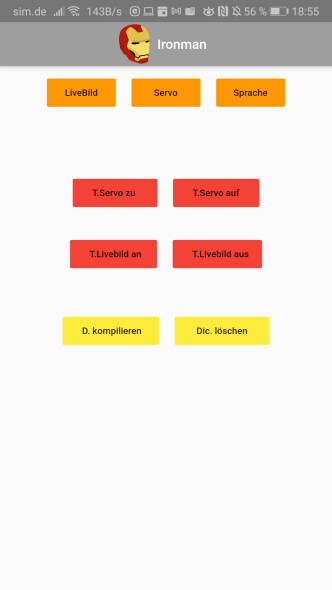

# Helmsteuerung Ironman 
Dieses Repository befasst sich mir der Entwicklung einer Software, für die Steuerung eines "Ironman Helmes".

# Images befinden sich im Ordner Images
    - Benutzername: pi
    - Passwort: 1234
    - SSID: Ironman Wifi
    -Wifi-Passwort: 827hd73n28
    
## Wichtig: auch bei den "fertigen Images" müssen die Mikrofon- und Sopareeinstellungen vorgenommen werden!
Siehe Inhaltsverzeichnis!
#### Videos zu Veranschaulichung der Funktionsweise befinden sich im Ordner Videos!
_*Inhaltsverzeichnis:*_
  - Funktionsumfang
  - Plattform
  - Sprachsteuerung
  - Pinbelegung GPIO
  - Manuelle Installationsanleitung
    - Installation von Raspbian
    - Optional: WPA Config und SSH aktivieren
    - Update/Upgrade vom System
    - Optional: Remote Desktop installieren
    - Tipp: Daten auf den Pi kopieren und herunterladen!
    - Installation der GPIO Python Bibliothek (RPi.GPIO 0.7.0)
    - Raspberry Pi Kamera im Setup aktivieren
    - Installation von Sopare Dependencies
    - Erstellung Hotspot (nur auf unterstützter Hardware!)
  - Mikrofon auswählen und Sopare Einstellungen
    - Alsamixer Standardmikrofon einstellen
    - Sopare Unit Test
    - Sopare Mikrofoneinstellungen
  - Testprogramme für die einzelnen Funktionen
    - Servotest
    - Livebild Test
    
   - Flutter APP zur Steuerung
     - App Bedienungsanleitung

## Funktionsumfang
Steuerung eines Servos.
Live Bild auf einem HDMI Monitor von einer Raspberry Pi Kamera.

Die Steuerung erfolgt wahlweise über Sprache, Taster an den GPIO Pins bzw einer Flutter App.

## Plattform
Als Einheit wird ein Raspberry Pi Zero verwendet, bzw ein Raspberry Pi 3.

Aufgrund der schwachen Rechenleitung des Raspberry Pi Zero's wird die Srachsteuerung auf selbiger Plattform nicht unterstützt.

**Folgende Tabelle zeigt welche Funtkionen auf den jeweiligen Raspberry Pi Modellen unterstützt werden.**
Getestet wurde die Software lediglich mit dem Raspberry Pi Zero und dem Raspberry Pi 3 Mod. B (v1.2)
Die restlichen Angaben beziehen sich auf die Eckdaten von der Raspberry Pi Foundation.

|**Funtionen**      | Zero          | Zero W/WH     | 1 Mod. A      | 1 Mod. B      | 
| ----------------- | ------------- | ------------- | ------------- | ------------- |
|**Sprachsteuerung**| kein Support  | kein Support  | kein Support  | kein Support  |
|**GPIO Taster**    | ja            | ja            | ja            | ja            |
|**Android/IOS App**| kein Support  | ja            | kein Support  | kein Support  |

|**Funtionen**      | 1 Mod. B+     | 2 Mod. B      | 2 Mod. B v1.2 | 3 Mod. B      |
| ----------------- | ------------- | ------------- | ------------- | ------------- |
|**Sprachsteuerung**| kein Support  | ja            | ja            | ja            |
|**GPIO Taster**    | ja            | ja            | ja            | ja            |
|**Android/IOS App**| kein Support  | kein Support  | kein Support  | ja            |

|**Funtionen**      | 3 Mod. B+     | 4 Mod. B      |
| ----------------- | ------------- | ------------- |
|**Sprachsteuerung**| ja            | ja            |
|**GPIO Taster**    | ja            | ja            |
|**Android/IOS App**| ja            | ja            |

## Sprachsteuerung 
Als Spracherkennung wird die Sofware **Sopare** verwendet.
Dies ist eine "Sound Pattern Recognition" Software die es erlaubt offline und in echtzeit Sprachbefehle zu verarbeiten.
Die Sofware wurde unter der Apache Lizenz veröffentlicht und kann über diesen Link aufgerufen werden: 
[Sopare](https://github.com/bishoph/sopare)

Eventuell wird es eine zweite Version geben, in der eine API Schnittstelle zu einem STT Server aufgebaut wird. (Google Cloud Speech-to-Text).
Diese Idee wurde jedoch vererst, aufgrund den damit verbundenen Kosten, verworfen.

## Pinbelegung Raspberry PI Servo und Taster
***Servomotor:***

***Drucktaster:***

## Manuelle Installationsanleitung
  -**Installation von Raspbian**
  
   Das offizilelle Image kann mithilfe von dem Pi Imager installiert werden.
   Download für Windows: [Download](https://downloads.raspberrypi.org/imager/imager_1.5.exe)
   
  -**Optional: WPA Config und SSH aktivieren**
  
  SSH und WPA Config File erstellen um per WLAN und Putty auf den Pi zugreifen zu können.
  Vorlage für beide Files befinden sich in diesem Repository.
  Wichtig: 
  
    ssh --> ohne Dateiendung (auch zu finden in diesem Repository)
    wpa_supplicant.conf --> SSID und Passswort im Klartext eingeben
    
  -**Update/Upgrade vom System**
    
     sudo apt-get update 
     sudo apt-get upgrade
  
  -**Optional: Remote Desktop installieren**

   Remote Desktop installieren zum Testen und Ausprobieren.

    sudo raspi-config --> Desktop Autologin
    (Die Option befindet sich unter System Options,Boot Auto Login, Desktop Autologin.)
    sudo apt-get purge realvnc-vnc-server --> RealVNC aufrung eines Konfliktes deinstallieren.
    sudo apt-get install xrdp --> XRDP installieren (Remote Desktop)
    sudo reboot (Neustart)
      
  -**Tipp: Daten auf den Pi kopieren und herunterladen!**

  Mithilfe des Windows Programms WinSCP können Dateien mühelos vom Pi auf den Copmuter und andersherum übetragen werden.
  Hier kann das Programm heruntergelden werden: [WinSCP](https://winscp.net/download/WinSCP-5.17.9-Setup.exe)
  
  -**Installation der GPIO Python Bibliothek (RPi.GPIO 0.7.0)**
   
       pip install RPi.GPIO
       
   Mithilfe von diesem Befehl kann das Paket installiert werden.
   Weitere Informationen zu dem Modul findet man hier: [PyPi.org](https://pypi.org/project/RPi.GPIO/)
   
  -**Raspberry Pi Kamera im Setup aktivieren**
      
      sudo raspi-config --> Interface Option --> Camera
     
   -**Erstellung Hotspot (nur auf unterstützter Hardware!)**
   
   
   Der Hotspot wird vom Raspberry aufgebaut und dient dazu die Software mithilfe der Flutter **App** zu **steuern**.
   Dazu verbindet man sein Smartphone mit dem Hotspot vom Raspberry Pi.
   
   
   -**Installation von Sopare Dependencies**
        
    sudo apt-get install build-essential 
    sudo apt-get install python-pyaudio 
    sudo apt-get install python-numpy
    sudo apt-get install python-scipy 
    sudo apt-get install python-matplotlib
    
   und noch zwei leere Ordner erstellen im Unterordner "sopare"......
    
      cd sopare
      mkdir tokens
      mkdir samples
  ## Mikrofon auswählen und Sopare Einstellungen
  ### Alsamixer Standardmikrofon einstellen
  Zunächst müssen wir dem Betriebsystem ein Standard Mikrofon zuweisen.
  Hierfür nutzen wir das Tool "Alsamixer", welches mit folgemdem Befehl geöffnet werden kann:
       
       alsamixer
  
  Mit F6 können wir nun unser Mikrofon auswählen:
  
  
  Danach noch mit mit der ESC Taste den Alsamixer verlassen.
  
  ### Sopare Unit Test
  ### Sopare Mikrofoneinstellungen
  
  ## Testprogramme für die einzelnen Funktionen
  ### Servo Test
  servotesting.py testet einen Servo der an den GPIO Pins angeschlossen ist.
  Dafür wurden folgende GPIO Pins verwendet:
  
    Signal: GPIO Pin 40 am Pi
    Masse: GND am Pi
    5V: 5Volt am Pi

  Bei dem Servotest wird der Servo auf 90°, 180° und 0° im 3 Sekundentakt gefahren.
  Wichtig: Der Servo wird nicht permanent mit einem PWM Signal versorgt! Da es sonst aufgrund der softwareseitgen Implementierung zu Timing Probleme kommen kann.
  (Zittern des Servos)
  D.h der Servo wird auf die Position gefahren und dann abgeschaltet, er hält nicht aktiv die Position.
  Je nachdem welche Last auf dem Servo liegt kann man dies vernachlässichen, da der Servo aufgrund des Getriebes im ausgeschaltetem Zustand schwer drehbar ist.
  
  Als Alternative könnte man gegebenfalls eine hardwareseitge Servosteuerung vornehmen mithilfe eines Servomotor Treibers.
  
  ### Livebild Test
  displaylive.py testet das Live Bild von einer Raspberry Pi Cam auf einen HDMI Monitor.
  
  Dafür öffnet das Programm ein Vorschaufenster im Vollbild und schließt dieses nach 50 Sekunden wieder.
  Während diesen 50 Sekunden sollte das Live Bild der Raspberry Pi Kamera sichtbar sein.
  
  Der Display Sleep Mode wird dadurch nicht unterbrochen.
  D.h der Raspberry geht nach ein paar Minuten ohne Tastatur/Maus eingabe in einen Sleep Mode, mit schwarzem Bild.
  Das schwarzes Bild wird von dem Live Feed überdeckt und nach dem Test erscheint wieder das schwarze Bild.
  
  ## Flutter APP (App kompatibel mit Android, IOS, Windows usw.)
  
 

Um die Software gut bedienen zu können wurde eine schlichte Flutter App entwickelt.
(Mit Flutter können Cross-Plattform Apps in der Programmiersprache Dart entwickelt werden)
Somit funktioniert die dem Projekt zugehörige App auf Android Smartphones als auch IOS basierenden Endgeräten.

Wichtig: Dateinahme zu lang bei einer Datei im Flutter Projekt.

warning: LF will be replaced by CRLF in IronmanHelmFlutter/pubspec.lock.
The file will have its original line endings in your working directory
[main 30dbafc] added flutter project warning: LF will be replaced by CRLF in IronmanHelmFlutter/android/gradle.properties.

Muss gegebenfalls nach dem Klonen umbenannt werden um weiterzuarbeiten.

Android APK wurde exportiert und befindet sich im Hauptverzeichnis. 

### App Bedienungsanleitung

Die App ist recht einfach aufgebaut, sie besteht aus neun Buttons.

Davon sind drei Buttons orange, vier rot und zwei gelb.

Die Farben spiegeln Gruppen wieder,
**Orangfarbene Gruppe** ist für die Steuerung der Grundfunktionen zuständig.

1. Livebild an bzw. aus
2. Servo Position ändern (0°/180°)
3. Sprachsteuerung an bzw. aus

Die Buttons ändern jeweils den Zustand der Funktion.
Standardmäßig ist das Livebild an und die Spracherkennung ausgeschaltet (nach jedem Neustart so)
Die App erhält kein Feedback vom Programm.
Falls die App nicht funtionieren sollte, ist zu schauen ob sich das Gerät im richtigen WLAN befindet (nur das eigene Hotspot WLAN wird von der App unterstützt).

Die rotfarbene Gruppe ist für das anlernen der Befehle zuständig.
Hier können die vier Befehle:
    
    - Servo auf
    - Servo zu
    - Livebild an
    - Livebild aus

angelernt werden.

Eine mögliche zuordnung der Befehle:

    - Servo auf: gesprochen "Servo auf"
    - Servo zu: gesprochen "zu"
    - Livebild an: gesprochen "Bild"
    - Livebild aus: gesprochen "Schwarz"

Der Lernprozess kann mehrmals hintereinander gestartet werden um ein immer besseres Ergebnis zu erhalten.

Nach jedem Lernprozess muss das Dictionary erneut "kompiliert" werden.
Dafür gibt es die gelbe Gruppe.
Wenn man etwas falsches angelernt hat, dann kann man ebenfalls das komplette Dictionary über den rechten gelben Knopf löschen.
